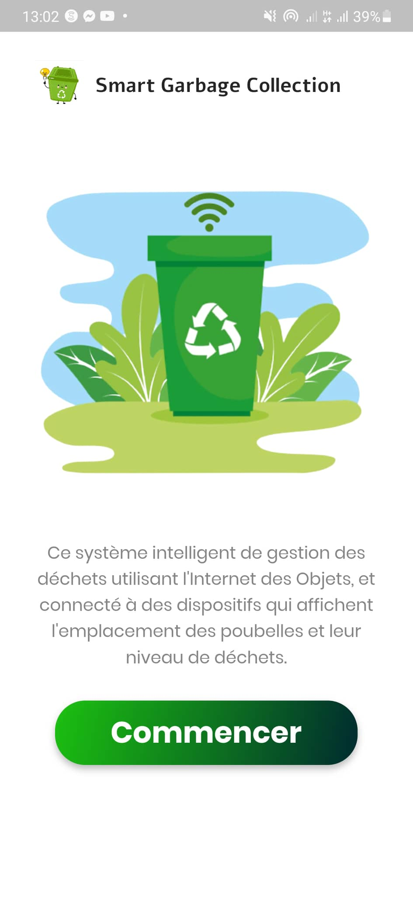
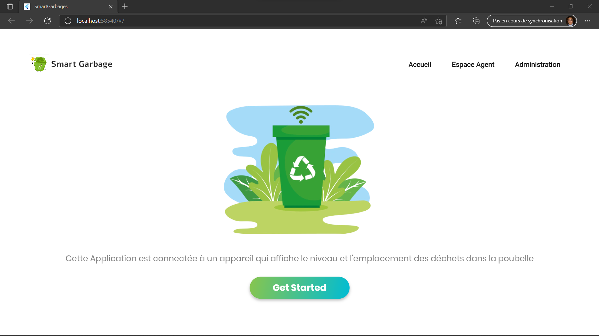

# Smart Garbage Collection System

A smart garbage collection system built using Flutter and Firebase that uses sensors to detect the percentage of garbage bin fill levels. The app allows the waste management team to view the status of all garbage bins. Additionally, the app helps users find the shortest route to a selected garbage bin.

## Screenshots

|  |  |  |
| ----------------------------- | ----------------------------- | ----------------------------- |

|  | ! |
| ----------------------------- | ----------------------------- |

## Features

- Real-time monitoring of garbage bins
- Finding the shortest route to a selected garbage bin

## Technologies Used

- Flutter for the mobile app development
- Firebase for real-time database and notification services
- ESP32 and HC-SR05 sensors for garbage bin monitoring

### Note about `Firestore_Poubelle.ino`

The `FirestorePoubelle.ino` file in the repository contains the sketch used for the ESP32 microcontroller to communicate with Firebase Firestore. The sketch should be uploaded to the ESP32 using the Arduino IDE or a similar programming environment.

## Finding the Shortest Route to a Selected Garbage Bin

If the user wants to navigate to a specific garbage bin, they can select the bin on the map and click on it. The app will then show the shortest route to the selected garbage bin on the map.
